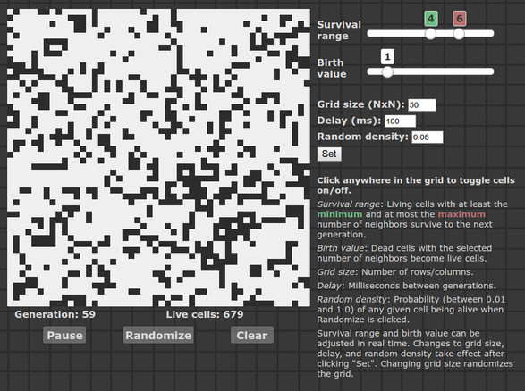
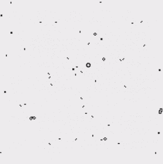
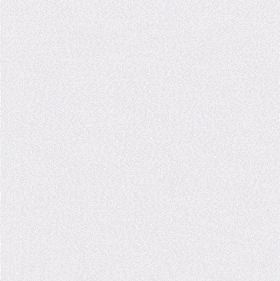

# Dynamic variations on Conway's Game of Life

This repo consists of my own JavaScript implementation of an interactive and
dynamic version of Conway's Game of Life—dynamic because the rules can be changed
on the fly, and interactive because the user (you!) can change them. The user
can also interact directly with the Game by clicking cells in the grid to
toggle them on and off. If you're not familiar with Conway's Game of Life,
read the [Background](#background) section below or check out the
[Wikipedia entry](https://en.wikipedia.org/wiki/Conway%27s_Game_of_Life).

In this implementation, the survival values (the number(s) of neighbors
necessary for a cell to survive to the next generation) take on a range rather
than discrete values. In other words, there's an *Smin* and an
*Smax*, and if a cell has *N* neighbors, then any given cell will
survive to the next generation if *Smin* ≤ *N* ≤ *Smax*.
The birth value is a single value rather than a range.

As an example, the birth value and survival range in the screenshot below would
be expressed in the usual Game of Life notation as B1/S456.

This implementation (which is essentially a simplified, dynamic version of the
[Larger than Life](http://www.conwaylife.com/wiki/Larger_than_Life) ruleset) 
can make for some interesting patterns and behavior.

&nbsp;&nbsp;&nbsp;&nbsp; 
  
&nbsp;&nbsp;&nbsp;&nbsp; 

The grid is fixed to be square, but its size (number of rows/columns) can be
adjusted. The grid can be randomized, and the random seed density (probability
that a given cell will be alive) can be adjusted.

## Background

[Conway's Game of Life](https://en.wikipedia.org/wiki/Conway%27s_Game_of_Life)
is a [cellular automaton](https://en.wikipedia.org/wiki/Cellular_automaton),
i.e., a "game" consisting of a 2D grid in which each cell (square) of the grid
can be either "alive" (on) or "dead" (off). The 8 cells surrounding any given
cell are called its [neighbors](https://en.wikipedia.org/wiki/Moore_neighborhood).

The original rules are as follows:

1) Any living cell with exactly 2 or 3 neighbors survives to the next
generation—otherwise, it dies.

2) Any dead cell with exactly 3 neighbors becomes alive during the next
generation, i.e., it is "born."

This is notated B3/S23, where the **B** indicates the number(s) of neighboring
cells necessary for a new cell to be **b**orn from a dead cell and **S** denotes 
the number(s) of neighboring cells for a living cell to **s**urvive to the
next generation.
